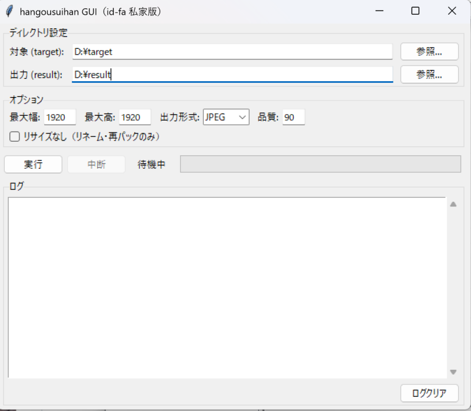

# hangousuihan (Python版)

[hangousuihan](https://dyama.org/hangousuihan/) の勝手移植版（Python実装）です。UNIX版 hangousuihan をベースに、画像アーカイブ（ZIP, 7Z, RAR, LZH）の展開・画像リサイズ・グレースケール化・ZIP再パッケージ機能を移植しています。CLI版とGUI版を同梱しています。

本家版にある回転・反転・レベル補正・各種フィルタ機能は実装されていません。

本家版にない独自機能として以下があります:

- ファイル名からSJIS（CP932）にないUnicode文字を除去
- 書庫内書庫（ネスト書庫）をすべて再帰的に展開



## 必要環境

- Python 3.10+

## セットアップ

```bash
cd test_python
pip install -r requirements.txt
```

### RAR対応（unrar.dll）

RAR形式のアーカイブを処理する場合、別途 **UnRAR DLL** が必要です。

1. [RARLab公式サイト](https://www.rarlab.com/rar_add.htm) から **UnRAR DLL** （`UnRARDLL.exe` 等の自己展開アーカイブ）をダウンロードして展開
2. Python のビット数に合わせた DLL を選択:
   - **64-bit Python** → 展開先の `x64\UnRAR64.dll`
   - **32-bit Python** → 展開先ルートの `UnRAR.dll`

   ※ ビット数を間違えると `[WinError 193] %1 は有効な Win32 アプリケーションではありません` というエラーが出ます。確認は `python -c "import struct; print(struct.calcsize('P')*8)"`
3. DLL を以下のいずれかに配置（スクリプト起動時に自動検出されます）:
   - `hangousuihan.py` と同じディレクトリ（`test_python/UnRAR64.dll` 等）
   - プロジェクト直下の `lib/` ディレクトリ（`lib/UnRAR64.dll` 等）
   - PATHが通ったディレクトリ（例: `C:\Windows\System32`）
4. 上記以外の場所に置く場合は環境変数を設定:
   ```
   set UNRAR_LIB_PATH=C:\path\to\UnRAR64.dll
   ```

※ ZIP, 7Z, LZH のみ使用する場合、UnRAR DLL は不要です。

## 使い方

### CLI版

処理対象のアーカイブを `./target/` に配置してから実行します。

```bash
# リサイズあり（最大1920x1920px）
python hangousuihan.py

# リサイズなし（リネーム・再パックのみ）
python hangousuihan.py 1

# グレースケール化
python hangousuihan.py --grayscale

# サフィックス変更（デフォルト: _new）
python hangousuihan.py -s ""

# 非画像ファイルを出力ZIPに含めない
python hangousuihan.py --no-copy-extra
```

結果は `./result/` に出力されます。

### GUI版

```bash
python hangousuihan-gui.py
```

以下の設定をGUI上で変更できます:

- **対象/出力ディレクトリ** — ファイルダイアログで選択
- **リサイズ最大幅・最大高** — デフォルト 1920x1920
- **出力画像形式** — JPEG / PNG / WEBP から選択（デフォルト JPEG）
- **品質** — デフォルト 90（JPEG/WEBPは品質値、PNGは圧縮レベルに変換）
- **グレースケール化** — チェックボックスで有効化
- **リサイズなしモード** — チェックボックスでリネーム・再パックのみに切替
- **画像以外のファイルも含める** — チェックボックスで非画像ファイルの同梱を制御（デフォルト ON）
- **処理中断** — 中断ボタンで処理を途中停止可能

## ディレクトリ構成

```
test_python/
├── hangousuihan.py      ← CLI版
├── hangousuihan-gui.py  ← GUI版
├── requirements.txt
├── target/              ← 処理対象を配置
├── tmp/                 ← 一時展開先（自動作成）
├── tmp_conv/            ← 変換出力先（自動作成・処理後クリーンアップ）
└── result/              ← 処理結果の出力先（自動作成）
```
